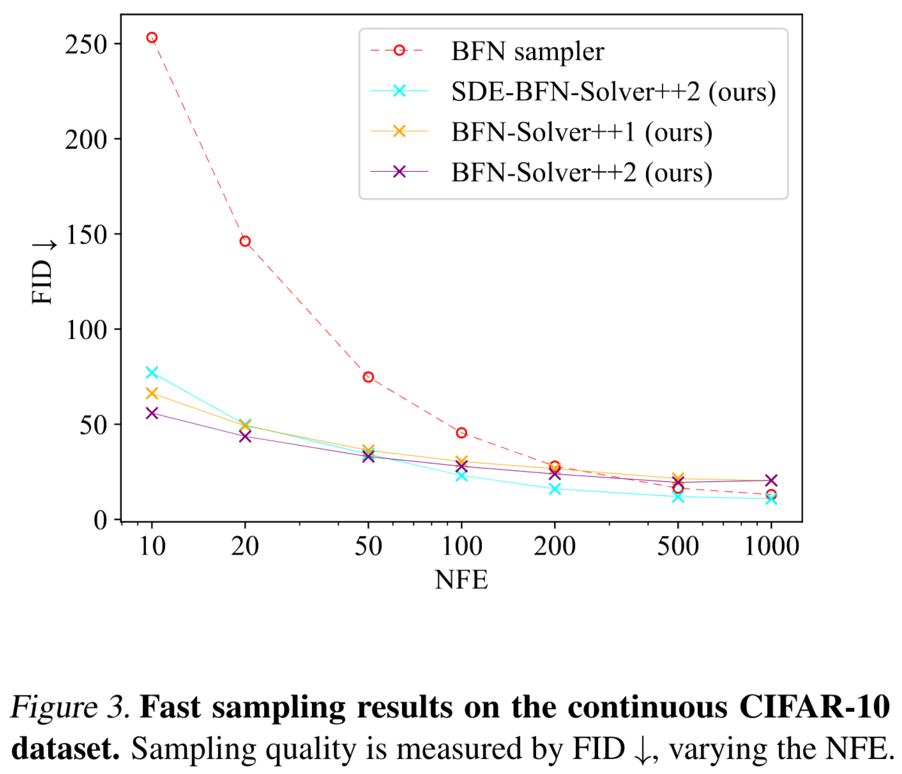
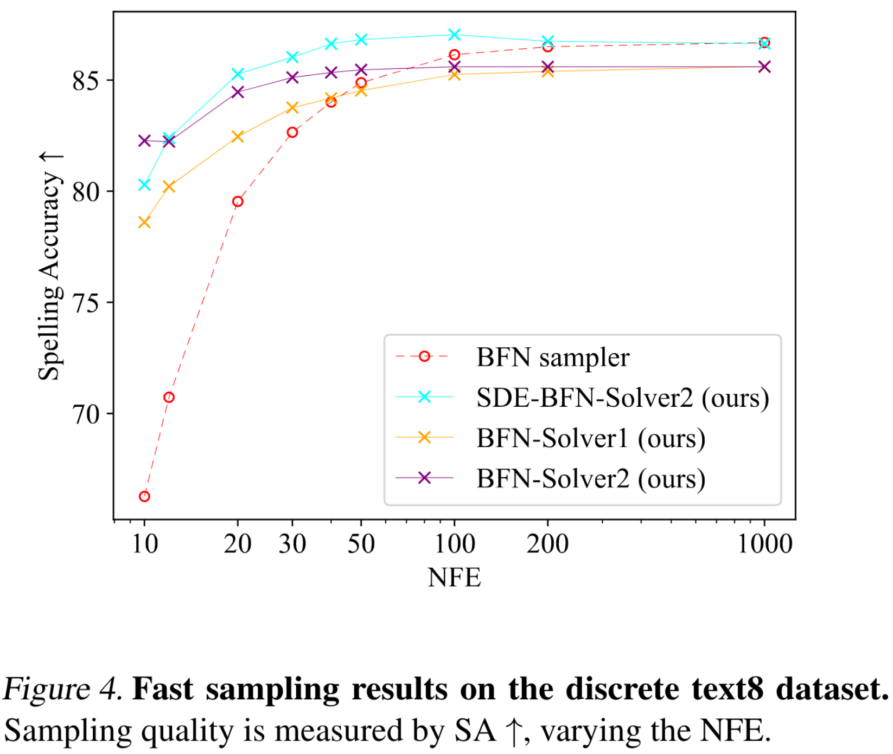

## BFN-Solver<br> <sub><small>Official PyTorch implementation for [Unifying Bayesian Flow Networks and Diffusion Models through Stochastic Differential Equations]()</small></sub>

Bayesian flow networks (BFNs) are promising in modeling both continuous and discrete data, while simultaneously maintaining fast sampling capabilities. 
We identify the linear SDEs corresponding to the noise-addition processes in BFNs, 
demonstrate that BFN’s regression losses are aligned with denoise score matching, 
and validate the sampler in BFN as a first-order solver for the respective reverse-time SDE. 

Based on these findings and existing recipes of fast sampling in Diffusion models, 
we propose specialized solvers for BFNs that markedly surpass the original BFN sampler in terms of sample quality with a limited number of function evaluations 
(e.g., 10) on both image and text datasets. Notably, our best sampler achieves an increase in speed of 5 ∼ 20 times for free.

-----------------

This codebase contains:
- Implementation of BFN-Solvers on continuous data and discrete data.
- Efficient sampling scripts on both image and text datasets. (CIFAR-10 and TEXT8)
- Efficient evaluation scripts on both image and text datasets. (CIFAR-10 and TEXT8)

## Dependency
```sh
conda env create -f env.yml
```

## Preparation Before Sampling and Evaluation

#### Pretrained Model
Download pretrained models from [pretrained-BFNs](https://huggingface.co/rupspace/pretrained-BFNs) and put them under `assets/pretrained_models` folder.

#### Reference statistics for FID
Download reference statistics from this [fid_stats](https://drive.google.com/file/d/13CH7oIB3IbveyuBsAPh8ZpsQ8ZJuFu9f/view?usp=sharing) (which contains reference statistics for FID) and put it under `assets/fid_stats` folder.

## Sampling
We provide  commands to reproduce the sampling results reported in the paper:
```sh
# cifar10 
python bfnsolver_i.py seed=1234 config_file=./configs/cifar10_continuous_256bins.yaml load_model=./assets/cifar10_256c_ema.pt algorithm=ode_bfnsolver1 n_steps=10

python bfnsolver_i.py seed=1234 config_file=./configs/cifar10_continuous_256bins.yaml load_model=./assets/cifar10_256c_ema.pt algorithm=ode_bfnsolver2_multi_step n_steps=10

python bfnsolver_i.py seed=1234 config_file=./configs/cifar10_continuous_256bins.yaml load_model=./assets/cifar10_256c_ema.pt algorithm=sde_bfnsolver2_multi_step n_steps=10

# text8 
python bfnsolver_t.py seed=1234 config_file=./configs/text8_discrete.yaml load_model=./assets/text8_ema.pt algorithm=ode_bfnsolver1 n_steps=10

python bfnsolver_t.py seed=1234 config_file=./configs/text8_discrete.yaml load_model=./assets/text8_ema.pt algorithm=ode_bfnsolver2_multi_step n_steps=10

python bfnsolver_t.py seed=1234 config_file=./configs/text8_discrete.yaml load_model=./assets/text8_ema.pt algorithm=sde_bfnsolver1 n_steps=10

python bfnsolver_t.py seed=1234 config_file=./configs/text8_discrete.yaml load_model=./assets/text8_ema.pt algorithm=sde_bfnsolver2_multi_step n_steps=10
```
The DiffEdit results will be put into `samples`.


## Evaluation
We provide commands to reproduce the evaluation results reported in the paper:
```sh
# cifar10 
python eval_bfnsolver_i.py seed=1234 config_file=./configs/cifar10_continuous_256bins.yaml load_model=./assets/cifar10_256c_ema.pt algorithm=ode_bfnsolver1 n_steps=10 n_samples=10000

python eval_bfnsolver_i.py seed=1234 config_file=./configs/cifar10_continuous_256bins.yaml load_model=./assets/cifar10_256c_ema.pt algorithm=ode_bfnsolver2_multi_step n_steps=10 n_samples=10000

python eval_bfnsolver_i.py seed=1234 config_file=./configs/cifar10_continuous_256bins.yaml load_model=./assets/cifar10_256c_ema.pt algorithm=sde_bfnsolver2_multi_step n_steps=10 n_samples=10000
 

# text8 
python eval_bfnsolver_t.py seed=1234 config_file=./configs/text8_discrete.yaml load_model=./assets/text8_ema.pt algorithm=ode_bfnsolver1 n_steps=10 n_samples=1000

python eval_bfnsolver_t.py seed=1234 config_file=./configs/text8_discrete.yaml load_model=./assets/text8_ema.pt algorithm=ode_bfnsolver2_multi_step n_steps=10 n_samples=1000

python eval_bfnsolver_t.py seed=1234 config_file=./configs/text8_discrete.yaml load_model=./assets/text8_ema.pt algorithm=sde_bfnsolver1 n_steps=10 n_samples=1000

python eval_bfnsolver_t.py seed=1234 config_file=./configs/text8_discrete.yaml load_model=./assets/text8_ema.pt algorithm=sde_bfnsolver2_multi_step n_steps=10 n_samples=1000
```
The DiffEdit results will be put into `eval_samples`.

<details open>
<summary><font size="2">
Evaluation results reported in the paper.
</font></summary>

<center>


</center>
</details>


## References


This implementation is based on
- [bayesian-flow-networks](https://github.com/nnaisense/bayesian-flow-networks) (provide the pretrained checkpoints on CIFAR10 and TEXT8)
- [U-ViT](https://github.com/baofff/U-ViT) (provide the FID reference statistics on CIFAR10)
- [pytorch-fid](https://github.com/mseitzer/pytorch-fid) (provide the official implementation of FID to PyTorch)
